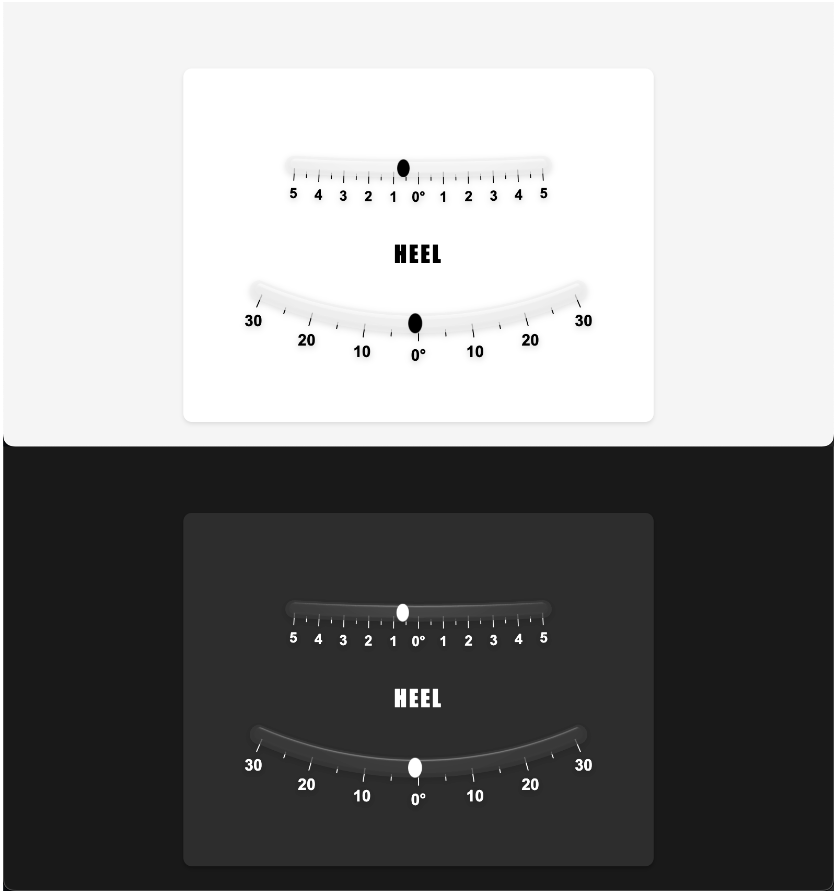

# SignalK Heel Angle Inclinometer

A simple digital recreation of a classic analog heel angle inclinometer, featuring both fine (-5° to +5°) and coarse (-35° to +35°) scales. 



## Features

- Uses `navigation.attitude.roll` path in SignalK (requires an IMU or other sensor providing this data)
- Analog-inspired design with a glass effect
- Dual scale display:
  - Fine scale (-5° to +5°) for precise readings near level
  - Coarse scale (-35° to +35°) for larger heel angles
- Dark mode support (click the text to toggle)
- Can be embedded in Kip dashboard or viewed standalone

## Installation

This webapp can be installed directly from the SignalK App Store in your SignalK server's admin interface.

### Manual Installation

1. Download or clone this repository
2. Run `npm install` to install dependencies
3. Run `npm run build` to create the production build
4. Copy the contents of the `dist` directory to your SignalK webapp directory

## Usage

1. Access your SignalK server's web interface
2. Navigate to Webapps
3. Click on "Heel Angle Inclinometer"
4. The webapp will automatically connect to your SignalK server and display real-time heel angle data

### Embedding in Kip Dashboard

The web app can be embedded as a webpage widget in your Kip dashboard:

1. In Kip, add a new "Webpage" widget to your dashboard
2. Enter the URL where your inclinometer is running:
   ```
   http://your-signalk-server/signalk-heel-angle/
   ```

### Configuration

The webapp allows for configuration of the SignalK connection via URL parameters:

- `signalkHost`: Custom SignalK server hostname (default: current hostname)
- `signalkPort`: Custom SignalK server port (default: 3000)
- `signalkUseTLS`: Use TLS for connection (default: false)

Example:
```
http://your-signalk-server/heel-angle/?signalkHost=openplotter.local&signalkPort=3000
```

## Development

1. Clone this repository
2. Install dependencies:
   ```bash
   npm install
   ```
3. Modify the `.env` file with your SignalK server details:
   ```
   VITE_SIGNALK_HOST=your-signalk-server
   VITE_SIGNALK_PORT=3000
   VITE_SIGNALK_USE_TLS=false
   ```
4. Start development server:
   ```bash
   npm run dev
   ```
5. Open http://localhost:5173 in your browser

## Contributing

Contributions are welcome! Please feel free to submit a Pull Request.

## License

This project is licensed under the MIT License - see the [LICENSE](LICENSE) file for details.

## Acknowledgments

- Inspired by the classic Silva marine inclinometer design